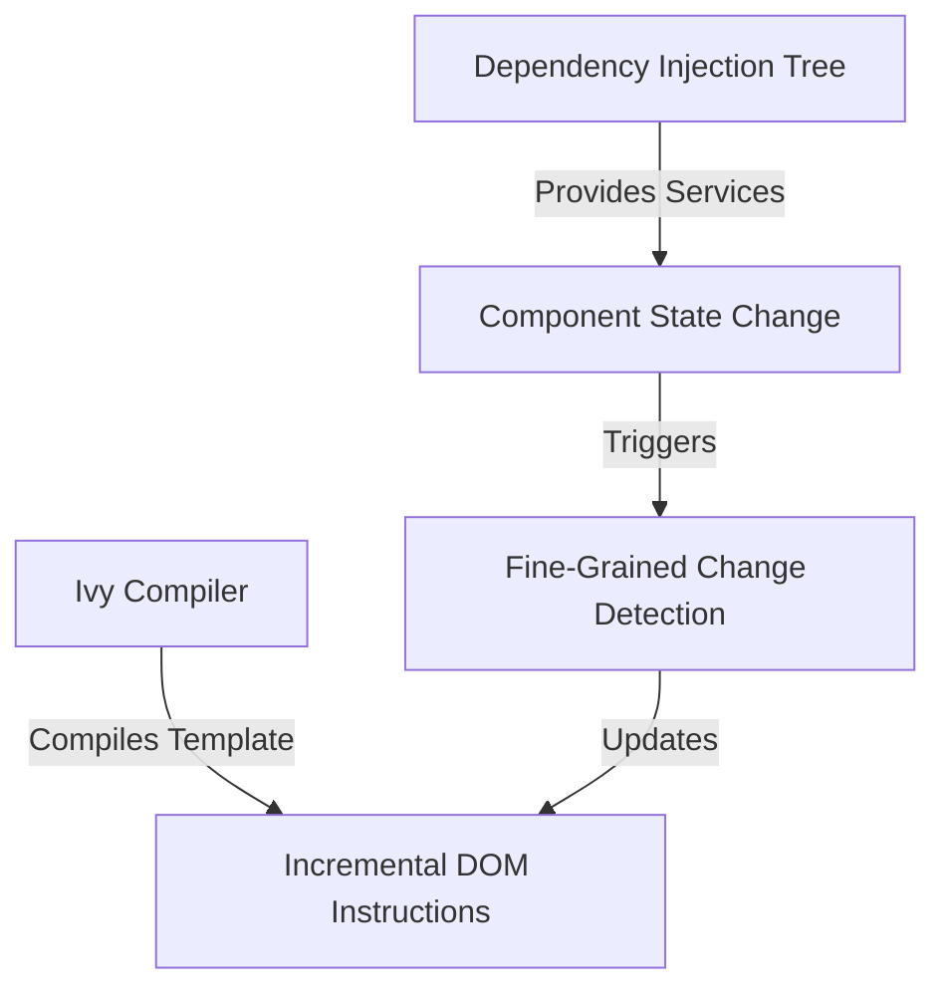

# Angular for Senior Engineers: An Architectural & Production-Ready Deep Dive

Welcome to Angular. This guide is designed for senior software engineers who are highly experienced in modern TypeScript, software architecture, and declarative UI ecosystems (such as React, Vue, or Svelte), but are new to Angular.

Applying the **Pareto Principle (80/20 Rule)**, this tutorial skips basic programming constructs, HTML/CSS binding, and standard package management. Instead, we target the critical 20% of Angular's design patterns, architectural features, and modern best practices (Angular 17+) that account for 80% of enterprise-level productivity.

---

## 1. Core Architecture Breakdown

### The Mental Model Shift

If you are coming from a Virtual DOM library like React:

*   **No Virtual DOM:** Angular does not use a Virtual DOM to compare state trees on every render. Instead, the Ivy compiler compiles your components' HTML templates into efficient, incremental DOM-updating instructions.
*   **Static vs. Dynamic Execution:** A React component is a function that runs in its entirety on every state change. An Angular component is a class instance. The constructor and lifecycle hooks run at distinct phases, and only the specific reactive bindings or Signals trigger target DOM updates.
*   **Hierarchical & Structured:** Angular is highly structured and opinionated. It relies on a strong separation of concerns via decorators, hierarchical Dependency Injection, and modular service-layer APIs.



---

### Modern Angular Building Blocks

#### 1. Standalone Components
In Angular 17+, standalone components are the default. There is no need for `NgModule` declarations. A standalone component declares its imports directly in its metadata.

```typescript
// user-card.component.ts
import { Component, Input, Output, EventEmitter, booleanAttribute } from '@angular/core';
import { CommonModule } from '@angular/common';

@Component({
  selector: 'app-user-card',
  standalone: true,
  imports: [CommonModule],
  template: `
    <div class="card" [class.active]="isActive">
      <h3>{{ name }}</h3>
      <button (click)="select.emit(name)">Select User</button>
    </div>
  `,
  styles: [`
    .card { padding: 1.5rem; border: 1px solid #ccc; border-radius: 8px; }
    .active { border-color: #007bff; }
  `]
})
export class UserCardComponent {
  @Input({ required: true }) name!: string;
  @Input({ transform: booleanAttribute }) isActive = false;
  @Output() select = new EventEmitter<string>();
}
```

*Architectural Tip:* Leverage `@defer` for automatic compiler-level lazy loading of component sub-trees. It can split bundle sizes dynamically based on interaction, viewport entry, or time.

```html
@defer (on viewport) {
  <app-heavy-chart [data]="chartData()" />
} @placeholder {
  <div class="skeleton">Loading chart...</div>
}
```

#### 2. Directives
Directives attach custom behavior to DOM elements. Structural directives modify DOM structure (using modern `@if`, `@for` control flow), while attribute directives modify appearance or behavior.

```typescript
// focus-highlight.directive.ts
import { Directive, ElementRef, Renderer2, HostListener, HostBinding, Input } from '@angular/core';

@Directive({
  selector: '[appFocusHighlight]',
  standalone: true
})
export class FocusHighlightDirective {
  @Input() highlightColor = '#f0f0f0';
  
  @HostBinding('style.transition') transition = 'background-color 0.3s ease';
  @HostBinding('style.backgroundColor') bgColor = 'transparent';

  @HostListener('focus') onFocus() {
    this.bgColor = this.highlightColor;
  }

  @HostListener('blur') onBlur() {
    this.bgColor = 'transparent';
  }
}
```

#### 3. Pipes
Pipes are pure data-transformation utilities usable inside templates.
*   **Pure Pipes:** Evaluated only when their input values change by reference. (Highly optimized).
*   **Impure Pipes:** Evaluated on every change detection cycle. (Avoid for performance-critical logic).

```typescript
// byte-format.pipe.ts
import { Pipe, PipeTransform } from '@angular/core';

@Pipe({
  name: 'byteFormat',
  pure: true,
  standalone: true
})
export class ByteFormatPipe implements PipeTransform {
  transform(bytes: number, decimalPlaces = 2): string {
    if (bytes === 0) return '0 Bytes';
    const k = 1024;
    const dm = decimalPlaces < 0 ? 0 : decimalPlaces;
    const sizes = ['Bytes', 'KB', 'MB', 'GB', 'TB'];
    const i = Math.floor(Math.log(bytes) / Math.log(k));
    return parseFloat((bytes / Math.pow(k, i)).toFixed(dm)) + ' ' + sizes[i];
  }
}
```

#### 4. Services
Services encapsulate business logic and data retrieval, separating the UI layer from infrastructure. They are typically singletons instantiated by Dependency Injection.

---

### Dependency Injection (DI) System

Angular features a powerful hierarchical DI engine. When a component requests a dependency, Angular traverses the injector tree upward:

1.  **Element Injector:** Configured in component/directive `@Component({ providers: [...] })`. Scoped to the component instance and its template children.
2.  **Environment Injector:** Configured in `app.config.ts` (`providers`) or routes.
3.  **Root Injector:** Configured via `@Injectable({ providedIn: 'root' })`. Singleton across the entire application context.

#### Modern `inject()` API vs Constructor Injection
Prefer the functional `inject()` API introduced in Angular 14. It improves TypeScript type safety, simplifies testing, and aligns with functional components/guards.

```typescript
// constructor pattern (Legacy)
constructor(private http: HttpClient) {}

// inject API pattern (Modern)
private http = inject(HttpClient);
```

---

### Change Detection & Reactivity: Zone.js vs. Signals

Historically, Angular relied on **Zone.js** to run change detection. Zone.js monkey-patches all asynchronous browser APIs (`setTimeout`, `Promise`, event listeners). When any async task completes, Zone.js triggers a top-down dirty check of the component tree (`ApplicationRef.tick()`). This is easy to write but carries massive overhead for large apps.

#### The Modern Paradigm: Signals
Angular Signals provide fine-grained reactivity. Instead of checking the entire tree, Angular builds a dependency graph and updates only the specific bindings linked to the modified Signals.

*   `signal(value)`: A writable reactive value wrapper.
*   `computed(() => fn)`: A read-only derived value that memoizes computation and updates when dependencies change.
*   `effect(() => fn)`: A mechanism to run side effects (logging, DOM operations, localStorage sync). Automatically runs inside a reactive context.

```typescript
import { signal, computed, effect } from '@angular/core';

const count = signal(0);
const doubleCount = computed(() => count() * 2);

effect(() => {
  console.log(`The count is: ${count()} (double: ${doubleCount()})`);
});

count.set(5); // Logs: The count is: 5 (double: 10)
count.update(v => v + 1); // Logs: The count is: 6 (double: 12)
```

By switching to **Zoneless Angular** (available in Angular 18+), you can drop `zone.js` entirely from your bundles, achieving massive performance gains.

---

### Fixation Exercise 1: Building a Signal-Based Store
*Architectural Task:* Create a lightweight, type-safe Signal-based State Store pattern (similar to mini-NgRx or Pinia) that leverages Angular's Dependency Injection system. The store must support read-only state selection, state updates via reducer functions, and async action side effects.

#### Solution Code

```typescript
// src/app/core/store/signal-store.ts
import { computed, Injectable, Signal, signal, WritableSignal } from '@angular/core';

export class SignalStore<T extends object> {
  // Read-only state backing signal
  private readonly _state: WritableSignal<T>;

  // Public read-only exposure of current state
  readonly state: Signal<T>;

  constructor(initialState: T) {
    this._state = signal<T>(initialState);
    this.state = this._state.asReadonly();
  }

  // Select a sub-slice of state with memoization
  select<K>(selector: (state: T) => K): Signal<K> {
    return computed(() => selector(this._state()));
  }

  // Synchronous state modification (Reducer/Mutation pattern)
  update(reducer: (state: T) => Partial<T>): void {
    this._state.update(current => ({
      ...current,
      ...reducer(current)
    }));
  }
}
```

**Usage implementation for a local UI store:**

```typescript
// src/app/features/users/user-store.service.ts
import { Injectable, inject } from '@angular/core';
import { SignalStore } from '../../core/store/signal-store';
import { HttpClient } from '@angular/common/http';
import { firstValueFrom } from 'rxjs';

interface UserState {
  users: Array<{ id: number; name: string }>;
  loading: boolean;
  error: string | null;
}

@Injectable()
export class UserStore extends SignalStore<UserState> {
  private http = inject(HttpClient);

  // Expose selectors
  readonly users = this.select(s => s.users);
  readonly loading = this.select(s => s.loading);
  readonly error = this.select(s => s.error);

  constructor() {
    super({ users: [], loading: false, error: null });
  }

  // Async side-effect action
  async loadUsers() {
    this.update(s => ({ loading: true, error: null }));
    try {
      const users = await firstValueFrom(this.http.get<any[]>('/api/users'));
      this.update(() => ({ users, loading: false }));
    } catch (err: any) {
      this.update(() => ({ error: err.message || 'Failed to fetch', loading: false }));
    }
  }
}
```

---

## 2. Creating a Project from Scratch

### 1. Installing the Angular CLI
First, install the CLI globally or use `npx` to execute commands on the fly:

```bash
npm install -g @angular/cli
```

---

### 2. Initializing a Clean, Production-Ready Project
Create a new project using strict compiler configurations, CSS/SCSS preprocessor setup, standalone components, and routing enabled:

```bash
ng new senior-app --style=scss --routing --standalone --strict --package-manager=npm
```

*What this flag setup does:*
*   `--style=scss`: Configures the Sass preprocessor.
*   `--routing`: Pre-wires the App routing configuration.
*   `--standalone`: Configures components to bootstrap without NgModules.
*   `--strict`: Enforces strict type checking, non-nullable properties, and stricter template compiler checks.

---

### 3. Critical Files Workspace Breakdown

```
my-angular-workspace/
├── angular.json               # CLI workspace configuration (builder targets, budgets, styles)
├── tsconfig.json              # Global TypeScript config
├── tsconfig.app.json          # Angular application compilation settings
├── src/
│   ├── main.ts                # Application bootstrapping file
│   ├── app/
│   │   ├── app.config.ts      # Core Application Configuration Providers (routes, interceptors)
│   │   ├── app.routes.ts      # Main App Route configurations
│   │   └── app.component.ts   # Root Component
│   └── index.html             # HTML entry point containing <app-root>
```

#### `main.ts` (Entry Point)
Angular uses `bootstrapApplication` to boot the root Standalone component using configuration providers.

```typescript
// src/main.ts
import { bootstrapApplication } from '@angular/platform-browser';
import { appConfig } from './app/app.config';
import { AppComponent } from './app/app.component';

bootstrapApplication(AppComponent, appConfig)
  .catch((err) => console.error(err));
```

#### `app.config.ts` (Configuration Providers)
This is where you register providers instead of an `app.module.ts`.

```typescript
// src/app/app.config.ts
import { ApplicationConfig, provideZoneChangeDetection } from '@angular/core';
import { provideRouter, withComponentInputBinding } from '@angular/router';
import { provideHttpClient, withInterceptors } from '@angular/common/http';
import { routes } from './app.routes';

export const appConfig: ApplicationConfig = {
  providers: [
    // Optimizes event change detection cycles (Zone.js event coalescing)
    provideZoneChangeDetection({ eventCoalescing: true }),
    // Configures routes and enables routing parameters mapped directly to inputs
    provideRouter(routes, withComponentInputBinding()),
    // Configures standard HTTP client
    provideHttpClient()
  ]
};
```

---

### 4. Verification
Spin up the development server:

```bash
ng serve --port 4200 --open
```

Navigate to `http://localhost:4200` to verify a successful initialization.

---

### Fixation Exercise 2: Workspace Customization
*Architectural Task:* Customizing environments and routing paths.
1.  Configure two environments: `development` and `production` under a modern dynamic provider setup in Angular 17+.
2.  Set up TypeScript path aliases (`@core/*`, `@shared/*`, `@env/*`) in `tsconfig.json` so you do not use relative paths like `../../../../core/services`.

#### Solution Configs

**TypeScript Path Mapping Configuration:**
Update `tsconfig.json` to add paths inside `compilerOptions`:

```json
// tsconfig.json
{
  "compilerOptions": {
    "baseUrl": "./",
    "paths": {
      "@core/*": ["src/app/core/*"],
      "@shared/*": ["src/app/shared/*"],
      "@env/*": ["src/environments/*"]
    }
  }
}
```

**Environment Architecture Setup:**
Create the environments directory structure under `src/environments/`:

```typescript
// src/environments/environment.model.ts
export interface Environment {
  production: boolean;
  apiUrl: string;
}

// src/environments/environment.development.ts
import { Environment } from './environment.model';
export const environment: Environment = {
  production: false,
  apiUrl: 'http://localhost:3000/api'
};

// src/environments/environment.production.ts
import { Environment } from './environment.model';
export const environment: Environment = {
  production: true,
  apiUrl: 'https://api.enterprise.com/v1'
};
```

Configure build replacements in `angular.json` to swap the configurations on production build:

```json
// angular.json (Inside projects -> senior-app -> architect -> build -> configurations)
{
  "configurations": {
    "production": {
      "fileReplacements": [
        {
          "replace": "src/environments/environment.development.ts",
          "with": "src/environments/environment.production.ts"
        }
      ]
    }
  }
}
```

---

## 3. Essential Core Features (The 80/20 Toolkit)

### Reactive Forms: Dynamic, Strictly Typed

Angular provides two form paradigms: Template-driven (avoid) and Reactive Forms. Reactive Forms provide structured, immutable state management over form controls.

#### Strictly Typed Forms
Since Angular 14, Forms are strictly typed. Let's create a dynamic form model featuring sub-groups, validations, and dynamic controls (`FormArray`).

```typescript
// profile-form.component.ts
import { Component, inject } from '@angular/core';
import { NonNullableFormBuilder, Validators, ReactiveFormsModule, FormArray, FormGroup, FormControl } from '@angular/forms';
import { CommonModule } from '@angular/common';

@Component({
  selector: 'app-profile-form',
  standalone: true,
  imports: [CommonModule, ReactiveFormsModule],
  template: `
    <form [formGroup]="userForm" (ngSubmit)="submit()">
      <input formControlName="email" type="email" placeholder="Email" />
      <div *ngIf="userForm.controls.email.touched && userForm.controls.email.invalid">
        Email is required and must be valid.
      </div>

      <div formArrayName="skills">
        <div *ngFor="let control of skills.controls; let i = index">
          <input [formControlName]="i" placeholder="Enter skill" />
          <button type="button" (click)="removeSkill(i)">Delete</button>
        </div>
      </div>
      <button type="button" (click)="addSkill()">Add Skill</button>

      <button type="submit" [disabled]="userForm.invalid">Submit</button>
    </form>
  `
})
export class ProfileFormComponent {
  private fb = inject(NonNullableFormBuilder);

  // Setup form with safe, non-nullable initial state
  userForm = this.fb.group({
    email: ['', [Validators.required, Validators.email]],
    skills: this.fb.array([this.fb.control('', Validators.required)])
  });

  // Safe getter for FormArray controls
  get skills(): FormArray<FormControl<string>> {
    return this.userForm.controls.skills;
  }

  addSkill() {
    this.skills.push(this.fb.control('', Validators.required));
  }

  removeSkill(index: number) {
    this.skills.removeAt(index);
  }

  submit() {
    if (this.userForm.valid) {
      // getRawValue() yields runtime-accurate values bypassing disabled states
      const rawValueValue = this.userForm.getRawValue();
      console.log(rawValueValue); // Typed as { email: string; skills: string[] }
    }
  }
}
```

---

### Routing & Navigation: Lazy Loading, Guards, Resolvers

Angular's router manages views, handles URL changes, and resolves lazy-loaded bundles using configuration declarations.

#### Route Definition Setup

```typescript
// src/app/app.routes.ts
import { Routes } from '@angular/router';
import { authGuard } from './core/guards/auth.guard';
import { dataResolver } from './core/resolvers/data.resolver';

export const routes: Routes = [
  {
    path: 'auth',
    loadChildren: () => import('./features/auth/auth.routes').then(r => r.AUTH_ROUTES)
  },
  {
    path: 'dashboard',
    // Lazy load a single standalone component
    loadComponent: () => import('./features/dashboard/dashboard.component').then(c => c.DashboardComponent),
    canActivate: [authGuard],
    resolve: { resolvedData: dataResolver }
  },
  { path: '**', redirectTo: 'dashboard' }
];
```

#### Functional CanActivate Guard
Functional Guards execute within Angular's active injection context.

```typescript
// src/app/core/guards/auth.guard.ts
import { inject } from '@angular/core';
import { CanActivateFn, Router } from '@angular/router';
import { AuthService } from '../services/auth.service';

export const authGuard: CanActivateFn = (route, state) => {
  const authService = inject(AuthService);
  const router = inject(Router);

  if (authService.isLoggedIn()) {
    return true;
  }

  // Redirect to signin route and cancel navigation
  return router.createUrlTree(['/auth/login'], { queryParams: { returnUrl: state.url } });
};
```

#### Functional Resolver
Resolvers pull API data before starting navigation, preventing UI flicker.

```typescript
// src/app/core/resolvers/data.resolver.ts
import { inject } from '@angular/core';
import { ResolveFn } from '@angular/router';
import { DashboardService } from '../services/dashboard.service';
import { catchError, of } from 'rxjs';

export const dataResolver: ResolveFn<any> = (route, state) => {
  const dashboardService = inject(DashboardService);
  return dashboardService.getStats().pipe(
    catchError(() => of({ stats: null, error: 'Failed to pre-fetch statistics' }))
  );
};
```

---

### HTTP Client & API Integration

The `HttpClient` provides HTTP requesting capabilities on top of RxJS Observables.

#### Registering HttpClient
Ensure HTTP operations are available globally within `app.config.ts`:

```typescript
export const appConfig: ApplicationConfig = {
  providers: [
    provideHttpClient(
      withInterceptors([authInterceptor, errorInterceptor])
    )
  ]
};
```

#### Functional Http Interceptor
Use functional interceptors to mutate outgoing requests or handle incoming errors.

```typescript
// src/app/core/interceptors/auth.interceptor.ts
import { HttpInterceptorFn } from '@angular/common/http';
import { inject } from '@angular/core';
import { AuthService } from '../services/auth.service';

export const authInterceptor: HttpInterceptorFn = (req, next) => {
  const authService = inject(AuthService);
  const token = authService.getToken();

  if (token) {
    const clonedRequest = req.clone({
      setHeaders: {
        Authorization: `Bearer ${token}`
      }
    });
    return next(clonedRequest);
  }

  return next(req);
};
```

#### RxJS and Signals Interoperability
Use `@angular/core/rxjs-interop` to seamlessly move between RxJS streams and Angular Signals.

*   `toSignal(observable)`: Converts an Observable into a read-only Signal.
*   `toObservable(signal)`: Converts a Signal into an Observable that fires when the signal value changes.

```typescript
import { Component, inject } from '@angular/core';
import { HttpClient } from '@angular/common/http';
import { toSignal } from '@angular/core/rxjs-interop';

@Component({
  selector: 'app-users-list',
  standalone: true,
  template: `
    <ul>
      @for (user of users(); track user.id) {
        <li>{{ user.name }}</li>
      } @empty {
        <li>No users loaded.</li>
      }
    </ul>
  `
})
export class UsersListComponent {
  private http = inject(HttpClient);

  // Directly exposes response stream as a readonly Signal
  users = toSignal(this.http.get<any[]>('/api/users'), { initialValue: [] });
}
```

---

### Fixation Exercise 3: Advanced Reactive Form with Custom Validator & Interceptor flow
*Architectural Task:* Create an advanced, secure system config panel.
1.  Implement a Typed Form representing server settings: `port` (number) and `domain` (string).
2.  Write a custom **async validator** that calls an API to check if the port is already in use.
3.  Implement a global **Error Interceptor** that catches `401 Unauthorized` responses from the validator or form submits, displays a notification via an injected service, and redirects the user to `/login` using a functional setup.

#### Solution Implementation

**1. The Error Interceptor:**

```typescript
// src/app/core/interceptors/error.interceptor.ts
import { HttpInterceptorFn, HttpErrorResponse } from '@angular/common/http';
import { inject } from '@angular/core';
import { Router } from '@angular/router';
import { catchError, throwError } from 'rxjs';
import { NotificationService } from '../services/notification.service';

export const errorInterceptor: HttpInterceptorFn = (req, next) => {
  const router = inject(Router);
  const notifier = inject(NotificationService);

  return next(req).pipe(
    catchError((error: HttpErrorResponse) => {
      if (error.status === 401) {
        notifier.show('Session expired. Please log in again.');
        router.navigate(['/login']);
      }
      return throwError(() => error);
    })
  );
};
```

**2. The Dynamic Validator & Configuration Component:**

```typescript
// src/app/features/config/config.component.ts
import { Component, inject } from '@angular/core';
import { CommonModule } from '@angular/common';
import { 
  NonNullableFormBuilder, 
  Validators, 
  ReactiveFormsModule, 
  AbstractControl, 
  AsyncValidatorFn, 
  ValidationErrors 
} from '@angular/forms';
import { HttpClient } from '@angular/common/http';
import { Observable, timer, of } from 'rxjs';
import { map, switchMap, catchError } from 'rxjs/operators';

@Component({
  selector: 'app-config',
  standalone: true,
  imports: [CommonModule, ReactiveFormsModule],
  template: `
    <form [formGroup]="configForm" (ngSubmit)="saveConfig()">
      <div>
        <label>Server Domain</label>
        <input formControlName="domain" />
      </div>

      <div>
        <label>Server Port</label>
        <input formControlName="port" type="number" />
        <div *ngIf="port.pending">Validating port availability...</div>
        <div *ngIf="port.errors?.['portTaken']">Port is already in use on host.</div>
        <div *ngIf="port.errors?.['required']">Port is required.</div>
      </div>

      <button type="submit" [disabled]="configForm.invalid">Save Settings</button>
    </form>
  `
})
export class ConfigComponent {
  private fb = inject(NonNullableFormBuilder);
  private http = inject(HttpClient);

  configForm = this.fb.group({
    domain: ['', [Validators.required]],
    port: [80, {
      validators: [Validators.required, Validators.min(1024), Validators.max(65535)],
      asyncValidators: [this.portAvailabilityValidator()]
    }]
  });

  get port() {
    return this.configForm.controls.port;
  }

  // Debounced Async Validator checking backend API
  private portAvailabilityValidator(): AsyncValidatorFn {
    return (control: AbstractControl): Observable<ValidationErrors | null> => {
      if (!control.value) {
        return of(null);
      }
      // Wait 300ms to debounce keypresses
      return timer(300).pipe(
        switchMap(() => 
          this.http.get<{ available: boolean }>(`/api/ports/check?port=${control.value}`).pipe(
            map(res => (res.available ? null : { portTaken: true })),
            catchError(() => of(null)) // Safe fallback
          )
        )
      );
    };
  }

  saveConfig() {
    if (this.configForm.valid) {
      this.http.post('/api/config', this.configForm.getRawValue()).subscribe({
        next: () => alert('Config saved successfully!'),
        error: () => alert('Failed to save config.')
      });
    }
  }
}
```

---

## 4. Key Takeaways for Senior Engineers

*   **Signals vs RxJS:** Use **Signals** for state, synchronous calculations, and rendering bindings. Use **RxJS** for asynchronous streaming, event throttling/debouncing, WebSocket channels, and complex API chain operations. Convert back to Signals using `toSignal()` to bind to template rendering.
*   **Dependency Injection is a Powerhouse:** DI is not just for injecting services. It handles dynamic configs, mocks for isolated unit tests, and allows swapping out underlying implementations without changing target component classes.
*   **Tree-Shaking Standalone Modules:** Because components now declare their own dependency scopes rather than inheriting them from massive global modules, Angular's build pipeline can strip out unused code with high efficiency.
